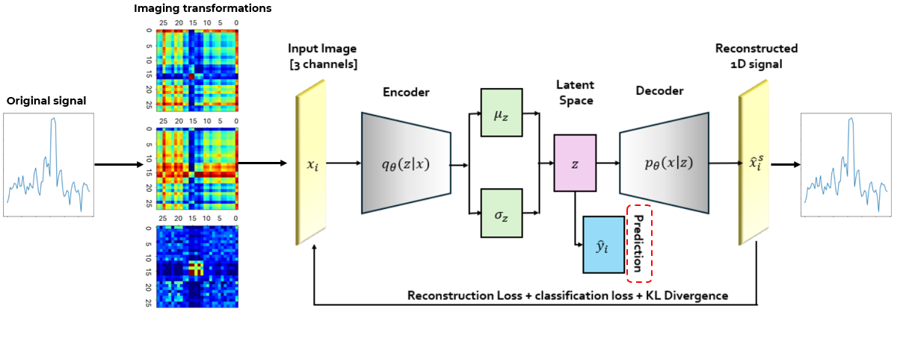

# Failure Prediction in Electrolyzers with Interpretable Image-Based Deep Learning and Unsupervised Domain Adaptation

## 📄 Abstract

We propose a scalable deep learning framework for failure prediction in industrial electrolyzers, transforming high-dimensional time-series data into structured multi-channel 2D representations suitable for convolutional neural networks. Central to our approach is a Variational AutoEncoder (VAE) that learns latent representations for effective anomaly detection. To enhance generalization across diverse operational settings, we integrate an Unsupervised Domain Adaptation (UDA) mechanism, facilitating robust model transferability across different electrolyzer configurations.

To address the interpretability challenge, we incorporate a counterfactual explanation module that identifies minimal perturbations in input signals required to alter prediction outcomes, aiding transparent failure diagnosis. Evaluations on multiple industrial datasets demonstrate a $25\%$ improvement in accuracy over direct supervised training approaches, achieving $89.91\%$ accuracy with only $11.07\%$ Symmetric Mean Absolute Percentage Error (sMAPE). Compared to baseline machine learning models, our method reduces reconstruction error by $50\%$, effectively capturing underlying failure patterns.

By leveraging multi-modal time-series representations, robust domain adaptation, and interpretable deep learning, our framework offers a generalizable solution for failure prediction in industrial systems, with potential applicability to a wide range of high-variance time-series anomaly detection tasks.

---

## 🔥 Pipeline Overview

<p align="center">
  
</p>

---

## ⚙️ Installation

Clone the repository:

```bash
git clone https://github.com/ECAI2025-FailurePred/anomaly-detection
```

Install the required dependencies:

```bash
pip install -r requirements.txt
```

---

## 🚀 How to Run

We provide a Jupyter Notebook that demonstrates the full pipeline:
- Data preprocessing
- Noise evolution signal generation
- Image transformations (GASF, GADF, MTF)
- Training the VAE model
- Applying UDA for domain adaptation
- Generating counterfactual explanations

**Note:**  
The data provided is synthetic and was generated to replicate the characteristics of real-world electrolyzer voltage signals (e.g., noise patterns, failure symptoms) as described in the paper.  
The code structure and methodology remain identical to those used on real industrial datasets.

---

## 🧪 Testing

You can test the complete pipeline using the synthetic dataset provided.  
The notebooks guide you step-by-step through:
- Data loading
- Preprocessing
- Model training
- Evaluation

---
